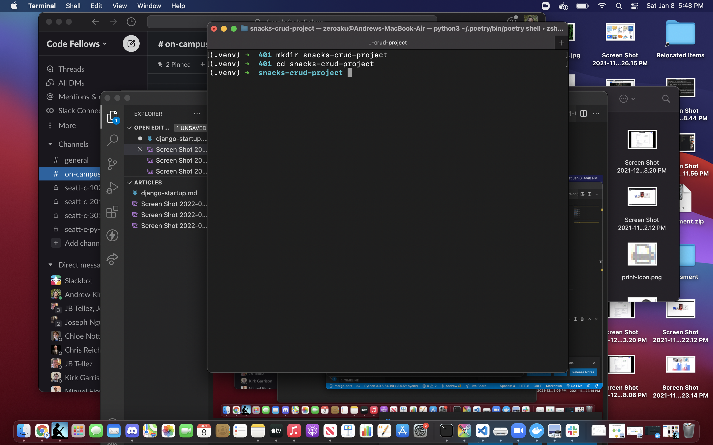
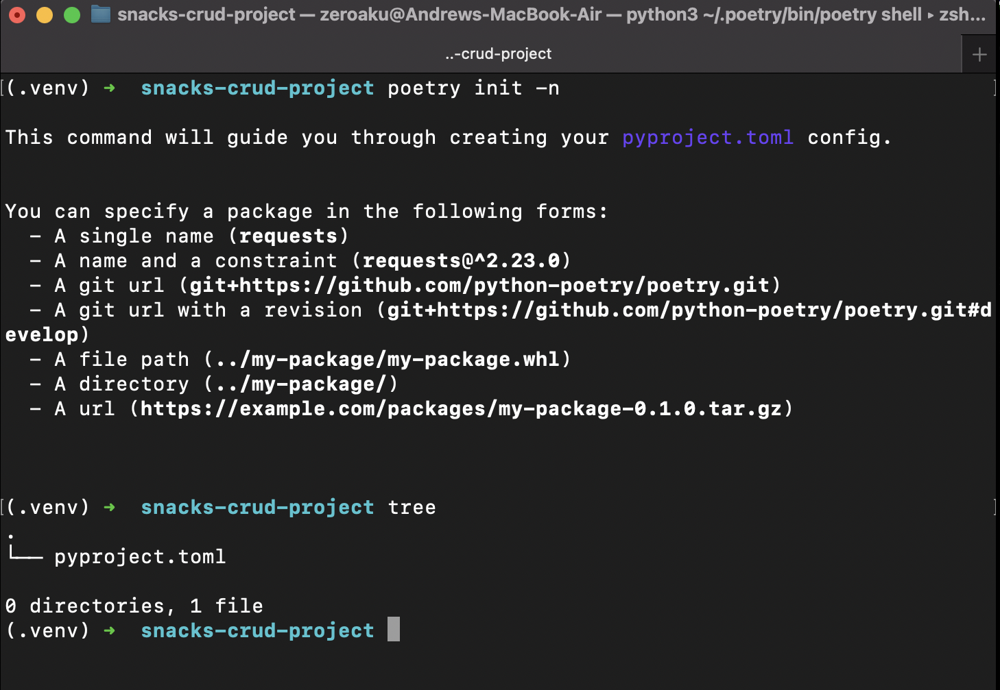
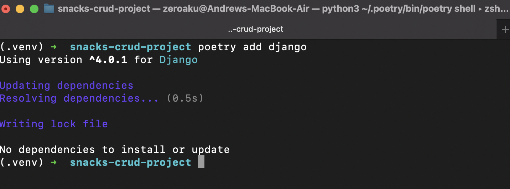
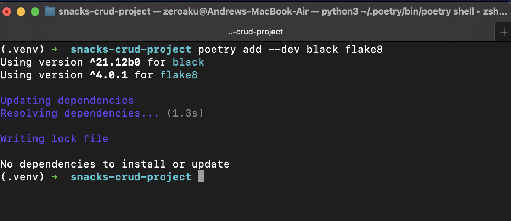
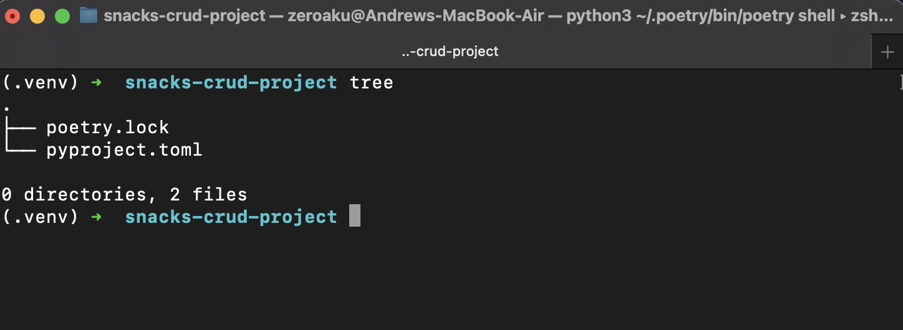
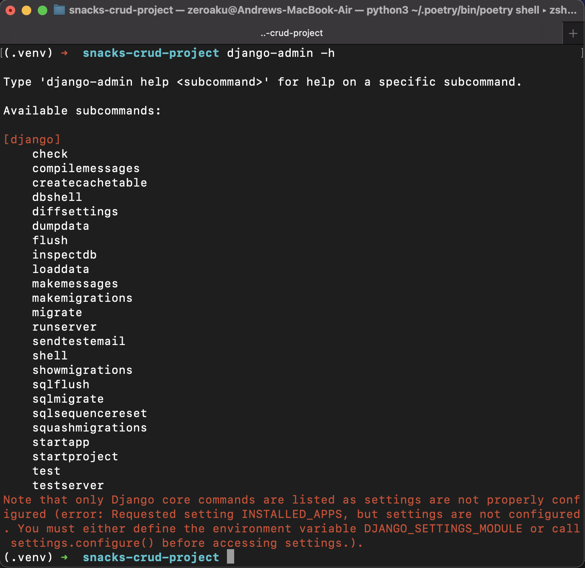
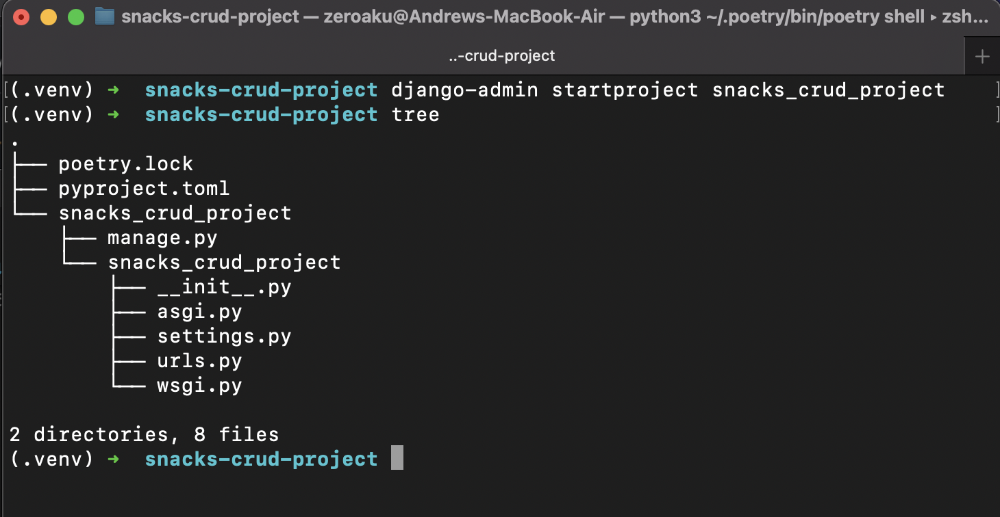
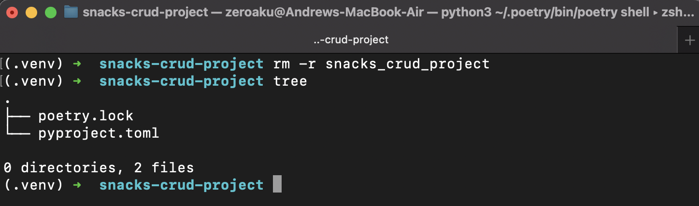
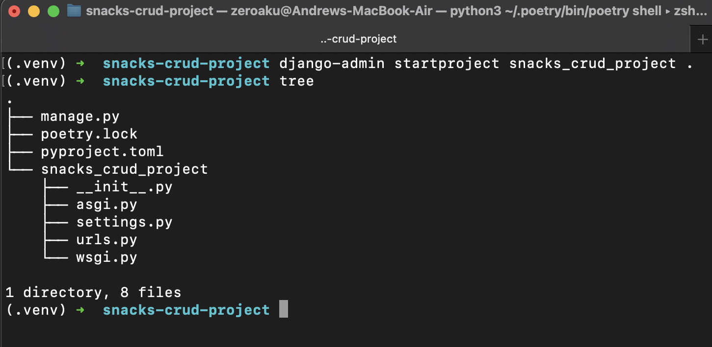

# Creating a Django App: From Zero

## Create Your Root Directory

First create your directory using the following command:
`mkdir name-of-root-directory`

- in this case snacks we're calling our root directory snacks-crud-app. I like using kebab-case for my repo names so I'll be sticking with that convention here

Once your root is created you'll want to cd into it for the next step using:
`cd name-of-root-directory`

Running the `tree` command in the terminal, we can see that we have an empy directory. We'll fix that shortly

## Initializing Project

We've got some set up to do before we're ready to start setting up our project, let's get started on that

### Initializing Poetry

To get poetry up and running for this project, we'll use the following command:
`poetry init -n`
Running `tree` once again we can see that that sets us up with our .toml file

### Installing Dependancies

First let's install the dependancies for our project. In this instance, this will only be Django. We'll use the following command for that:
`poetry add django`

Lets also go ahead and add our dev dependancies while we're here

Running `tree` again we see that we now have our poetry.lock file

## Getting Started With Django

Now that we have our dependancies installed let's see what we can do from here; to do that, we'll be using the following command:
`django-admin -h`

Woah that's a lot of commands! The one we're looking for right now is `startproject`

Entering `django-admin startproject name_of_project .` will create the file structure for our project. It's worth noting that the dot at the end is optional. Leaving it off will result in a double nested structure for your project. I'll first show you what that looks like.

As we can see inside of our snacks_crud_project directory we have another snacks_crud_project nested within it. That's not exactly what we're going for here so I'll enter in `rm -r snacks_crud_project` to delete that directory and bring us back to where we were previously

Let's try that again using the dot. Entering in `django-admin startproject snacks_crud_project .`

